# Awesome LLM Books

Some of us learn best by reading high quality books on technical topics.

This is a **curated list** of **books** for **engineers** on **development** with **Large Language Models** (LLMs).

## Books:

Alphabetical list of books on LLMs. Each cover/title links to more information about the book.

| Cover | Details |
|-------|---------|
|  | [AI Engineering](books/ai-engineering.md) **Subtitle**: Building Applications with Foundation Models **Authors**: Chip Huyen **Publisher**: O'Reilly, 2025 **Star Rating**: 5 on Amazon, 4.57 on Goodreads  **Links**: [Amazon](https://a.co/d/hAI9OXl) |
[Goodreads](https://www.goodreads.com/book/show/216848047-ai-engineering) |
[Publisher](https://www.oreilly.com/library/view/ai-engineering/9781098166298/) |
[GitHub Project](https://github.com/chiphuyen/aie-book) |
|  | [Build a Large Language Model](books/build-a-large-language-model.md) **Subtitle**: (From Scratch) **Authors**: Sebastian Raschka **Publisher**: Manning, 2024 **Star Rating**: 4.7 on Amazon, 4.65 on Goodreads  **Links**: [Amazon](https://a.co/d/bXGGLyC) |
[Goodreads](https://www.goodreads.com/book/show/219388329-build-a-large-language-model) |
[Publisher](https://www.manning.com/books/build-a-large-language-model-from-scratch) |
[GitHub Project](https://github.com/rasbt/LLMs-from-scratch) |
| [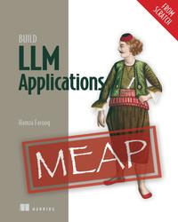](books/build-llm-applications.md) | [Build LLM Applications](books/build-llm-applications.md) **Subtitle**: (from Scratch) **Authors**: Hamza Farooq **Publisher**: Manning, 2025 **Links**: [Publisher](https://www.manning.com/books/build-llm-applications-from-scratch) |
| [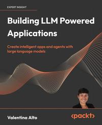](books/building-llm-powered-applications.md) | [Building LLM Powered Applications](books/building-llm-powered-applications.md) **Subtitle**: Create intelligent apps and agents with large language models **Authors**: Valentina Alto **Publisher**: Packt, 2024 **Star Rating**: 4.5 on Amazon, 3.40 on Goodreads  **Links**: [Amazon](https://a.co/d/e6rt1da) |
[Goodreads](https://www.goodreads.com/book/show/201054993-building-llm-powered-applications) |
[Publisher](https://www.packtpub.com/en-au/product/building-llm-powered-applications-9781835462317) |
[GitHub Project](https://github.com/PacktPublishing/Building-LLM-Powered-Applications) |
|  | [Building LLMs for Production](books/building-llms-for-production.md) **Subtitle**: Enhancing LLM Abilities and Reliability with Prompting, Fine-Tuning, and RAG **Authors**: Louis-François Bouchard and Louie Peters **Publisher**: Independently published, 2024 **Star Rating**: 4.5 on Amazon, 4.19 on Goodreads  **Links**: [Amazon](https://a.co/d/grz7eTc) |
[Goodreads](https://www.goodreads.com/book/show/213731760-building-llms-for-production) |
[Publisher](https://www.oreilly.com/library/view/building-llms-for/9798324731472/) |
|  | [Creating Production-Ready LLMs](books/creating-production-ready-llms.md) **Subtitle**: A Comprehensive Guide to Building, Optimizing, and Deploying Large Language Models for Production Use **Authors**: TransformaTech Institute  **Publisher**: Independently published, 2024 **Star Rating**: 4.6 on Amazon, 0.00 on Goodreads  **Links**: [Amazon](https://a.co/d/7nVhfVT) |
[Goodreads](https://www.goodreads.com/book/show/219981025-creating-production-ready-llms) |
[Publisher](https://www.amazon.com.au/stores/author/B0DJRMJX76/about) |
| [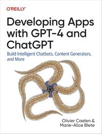](books/developing-apps-with-gpt-4-and-chatgpt.md) | [Developing Apps with GPT-4 and ChatGPT](books/developing-apps-with-gpt-4-and-chatgpt.md) **Subtitle**: Build Intelligent Chatbots, Content Generators, and More **Authors**: Olivier Caelen and Marie-Alice Blete **Publisher**: O'Reilly, 2023 **Star Rating**: 4.2 on Amazon, 3.65 on Goodreads  **Links**: [Amazon](https://a.co/d/8aDJJvi) |
[Goodreads](https://www.goodreads.com/book/show/181704874-developing-apps-with-gpt-4-and-chatgpt) |
[Publisher](https://www.oreilly.com/library/view/developing-apps-with/9781098152475/) |
[GitHub Project](https://github.com/malywut/gpt_examples) |
| [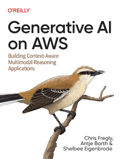](books/generative-ai-on-aws.md) | [Generative AI on AWS](books/generative-ai-on-aws.md) **Subtitle**: Building Context-Aware Multimodal Reasoning Applications **Authors**: Chris Fregly, Antje Barth and Shelbee Eigenbrode  **Publisher**: O'Reilly, 2023 **Star Rating**: 4.5 on Amazon, 4.50 on Goodreads  **Links**: [Amazon](https://a.co/d/f6xUdNI) |
[Goodreads](https://www.goodreads.com/book/show/197525483-generative-ai-on-aws) |
[Publisher](https://www.oreilly.com/library/view/generative-ai-on/9781098159214/) |
[GitHub Project](https://github.com/generative-ai-on-aws/generative-ai-on-aws) |
| [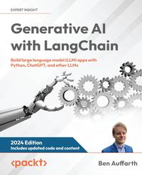](books/generative-ai-with-langchain.md) | [Generative AI with LangChain](books/generative-ai-with-langchain.md) **Subtitle**: Build large language model (LLM) apps with Python, ChatGPT, and other LLMs **Authors**: Ben Auffarth **Publisher**: Packt, 2023 **Star Rating**: 4.3 on Amazon, 3.42 on Goodreads  **Links**: [Amazon](https://a.co/d/8kVpV3T) |
[Goodreads](https://www.goodreads.com/book/show/185125672-generative-ai-with-langchain) |
[Publisher](https://www.packtpub.com/en-us/product/generative-ai-with-langchain-9781835083468) |
[GitHub Project](https://github.com/benman1/generative_ai_with_langchain) |
| [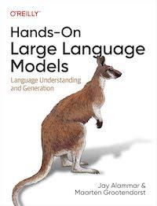](books/hands-on-large-language-models.md) | [Hands-On Large Language Models](books/hands-on-large-language-models.md) **Subtitle**: Language Understanding and Generation **Authors**: Jay Alammar and Maarten Grootendorst **Publisher**: O'Reilly, 2024 **Star Rating**: 4.6 on Amazon, 4.24 on Goodreads  **Links**: [Amazon](https://a.co/d/hXs5jDF) |
[Goodreads](https://www.goodreads.com/book/show/210408850-hands-on-large-language-models) |
[Publisher](https://www.oreilly.com/library/view/hands-on-large-language/9781098150952/) |
[GitHub Project](https://github.com/HandsOnLLM/Hands-On-Large-Language-Models) |
| [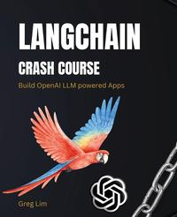](books/langchain-crash-course.md) | [LangChain Crash Course](books/langchain-crash-course.md) **Subtitle**: Build OpenAI LLM powered Apps: Fast track to building OpenAI LLM powered Apps using Python **Authors**: Greg Lim **Publisher**: Independently Published, 2024 **Star Rating**: 4.2 on Amazon, 4.13 on Goodreads  **Links**: [Amazon](https://a.co/d/ibgu6jy) |
[Goodreads](https://www.goodreads.com/book/show/198671257-langchain-crash-course) |
[Publisher](https://greglim.gumroad.com/l/langchain) |
|  | [Large Language Models](books/large-language-models.md) **Subtitle**: A Deep Dive: Bridging Theory and Practice **Authors**: Uday Kamath, Kevin Keenan, Garrett Somers, and Sarah Sorenson **Publisher**: Springer, 2024 **Star Rating**: 4 on Amazon, 3.50 on Goodreads  **Links**: [Amazon](https://a.co/d/6IMNpkX) |
[Goodreads](https://www.goodreads.com/book/show/214355031-large-language-models) |
[Publisher](https://link.springer.com/book/10.1007/978-3-031-65647-7) |
[GitHub Project](https://github.com/springer-llms-deep-dive/llms-deep-dive-tutorials) |
| [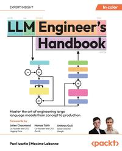](books/llm-engineer's-handbook.md) | [LLM Engineer's Handbook](books/llm-engineer's-handbook.md) **Subtitle**: Master the art of engineering large language models from concept to production **Authors**: Paul Iusztin and Maxime Labonne **Publisher**: Packt, 2024 **Star Rating**: 4.7 on Amazon, 4.00 on Goodreads  **Links**: [Amazon](https://a.co/d/5H3ufht) |
[Goodreads](https://www.goodreads.com/book/show/216193554-llm-engineer-s-handbook) |
[Publisher](https://www.packtpub.com/en-au/product/llm-engineers-handbook-9781836200062) |
[GitHub Project](https://github.com/PacktPublishing/LLM-Engineers-Handbook) |
|  | [LLMs in Production](books/llms-in-production.md) **Subtitle**: From language models to successful products **Authors**: Christopher Brousseau and Matthew Sharp **Publisher**: Manning, 2025 **Star Rating**: 3.00 on Goodreads  **Links**: [Amazon](https://a.co/d/gF1w56V) |
[Goodreads](https://www.goodreads.com/book/show/215144443-llms-in-production) |
[Publisher](https://www.manning.com/books/llms-in-production) |
[GitHub Project](https://github.com/IMJONEZZ/LLMs-in-Production) |
|  | [Natural Language Processing with Transformers](books/natural-language-processing-with-transformers.md) **Subtitle**: Building Language Applications with Hugging Face **Authors**: Lewis Tunstall, Leandro von Werra and Thomas Wolf **Publisher**: O'Reilly, 2022 **Star Rating**: 4.6 on Amazon, 4.42 on Goodreads  **Links**: [Amazon](https://a.co/d/5WIiVAC) |
[Goodreads](https://www.goodreads.com/book/show/60114857-natural-language-processing-with-transformers) |
[Publisher](https://www.oreilly.com/library/view/natural-language-processing/9781098136789/) |
[GitHub Project](https://github.com/nlp-with-transformers/notebooks) |
| [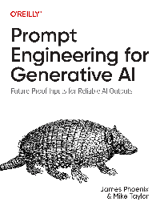](books/prompt-engineering-for-generative-ai.md) | [Prompt Engineering for Generative AI](books/prompt-engineering-for-generative-ai.md) **Subtitle**: Future-Proof Inputs for Reliable AI Outputs **Authors**: James Phoenix and Mike Taylor **Publisher**: O'Reilly, 2024 **Star Rating**: 4.4 on Amazon, 3.59 on Goodreads  **Links**: [Amazon](https://a.co/d/52xLb9K) |
[Goodreads](https://www.goodreads.com/book/show/204133880-prompt-engineering-for-generative-ai) |
[Publisher](https://www.oreilly.com/library/view/prompt-engineering-for/9781098153427/) |
[GitHub Project](https://github.com/BrightPool/prompt-engineering-for-generative-ai-examples) |
| [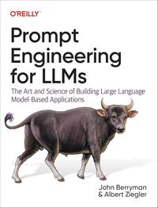](books/prompt-engineering-for-llms.md) | [Prompt Engineering for LLMs](books/prompt-engineering-for-llms.md) **Subtitle**: The Art and Science of Building Large Language Model–Based Applications **Authors**: John Berryman and Albert Ziegler **Publisher**: O'Reilly, 2024 **Star Rating**: 5 on Amazon, 0.00 on Goodreads  **Links**: [Amazon](https://a.co/d/eyWEQ4A) |
[Goodreads](https://www.goodreads.com/book/show/213739653-prompt-engineering-for-llms) |
[Publisher](https://www.oreilly.com/library/view/prompt-engineering-for/9781098156145/) |
| [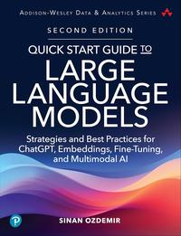](books/quick-start-guide-to-large-language-models.md) | [Quick Start Guide to Large Language Models](books/quick-start-guide-to-large-language-models.md) **Subtitle**: Strategies and Best Practices for ChatGPT, Embeddings, Fine-Tuning, and Multimodal AI **Authors**: Sinan Ozdemir  **Publisher**: Addison-Wesley, 2024 **Star Rating**: 5 on Amazon, 3.69 on Goodreads  **Links**: [Amazon](https://a.co/d/aUsDJ7e) |
[Goodreads](https://www.goodreads.com/book/show/126850297-quick-start-guide-to-large-language-models) |
[Publisher](https://www.pearson.com/en-us/subject-catalog/p/quick-start-guide-to-large-language-models-2nd-edition/P200000012793) |
[GitHub Project](https://github.com/sinanuozdemir/quick-start-guide-to-llms) |
| [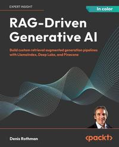](books/rag-driven-generative-ai.md) | [RAG-Driven Generative AI](books/rag-driven-generative-ai.md) **Subtitle**: Build custom retrieval augmented generation pipelines with LlamaIndex, Deep Lake, and Pinecone **Authors**: Denis Rothman **Publisher**: Packt, 2024 **Star Rating**: 4.1 on Amazon, 4.14 on Goodreads  **Links**: [Amazon](https://a.co/d/2zjaDK4) |
[Goodreads](https://www.goodreads.com/book/show/214330235-rag-driven-generative-ai) |
[Publisher](https://www.packtpub.com/en-us/product/rag-driven-generative-ai-9781836200918) |
[GitHub Project](https://github.com/Denis2054/RAG-Driven-Generative-AI) |
|  | [Super Study Guide](books/super-study-guide.md) **Subtitle**: Transformers & Large Language Models **Authors**: Afshine Amidi and Shervine Amidi  **Publisher**: Independently published, 2024 **Star Rating**: 4.8 on Amazon, 4.67 on Goodreads  **Links**: [Amazon](https://a.co/d/aE3pz72) |
[Goodreads](https://www.goodreads.com/book/show/217141763-super-study-guide) |
[Publisher](https://superstudy.guide/transformers-large-language-models/) |
| [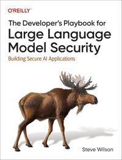](books/the-developer's-playbook-for-large-language-model-security.md) | [The Developer's Playbook for Large Language Model Security](books/the-developer's-playbook-for-large-language-model-security.md) **Subtitle**: Building Secure AI Applications **Authors**: Steve Wilson **Publisher**: O'Reilly, 2024 **Star Rating**: 5 on Amazon, 3.60 on Goodreads  **Links**: [Amazon](https://a.co/d/d3rJVkn) |
[Goodreads](https://www.goodreads.com/book/show/210408897-the-developer-s-playbook-for-large-language-model-security) |
[Publisher](https://www.oreilly.com/library/view/the-developers-playbook/9781098162191/) |
|  | [What Is ChatGPT Doing...](books/what-is-chatgpt-doing....md) **Subtitle**: ...and Why Does It Work? **Authors**: Stephen Wolfram **Publisher**: Wolfram Media Inc., 2023 **Star Rating**: 4.2 on Amazon, 3.89 on Goodreads  **Links**: [Amazon](https://a.co/d/79xVzR5) |
[Goodreads](https://www.goodreads.com/book/show/123451665-what-is-chatgpt-doing-and-why-does-it-work) |
[Publisher](https://writings.stephenwolfram.com/2023/02/what-is-chatgpt-doing-and-why-does-it-work/) |

### On Curation

The above list is not "all books on LLM development", instead it is filtered using the following procedure:

1. Create a [master list](https://docs.google.com/spreadsheets/d/1AGExX1aYINy_FsBRmr9z8OyalJcPso2mo28GraHqhSQ/edit?usp=sharing) of all known books on LLM development (amazon, goodreads, google books, etc.)
2. Read book blurb and table of contents to confirm relevance (for "engineers doing LLM development").
3. Read reviews and check star ratings for quality (quality check).
4. Read comments and discussion about the book on social (twitter/reddit/etc).
5. Acquire the ebook version of the book, if possible (final read/skim to confirm relevance and quality).
6. Final judgement call (publisher, gut check).

Note that I update the list based on newly published books and emails I received about new books. Additionally, listed star ratings are updated periodically.

### Make The List Better

Do you have ideas on how we make this list more awesome?

Email any time: Jason.Brownlee05@gmail.com