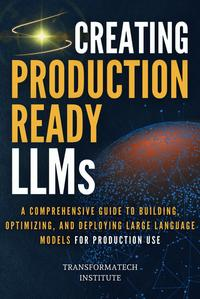

# Creating Production-Ready LLMs

[home](../)

## Details

* **Title**: Creating Production-Ready LLMs
* **Subtitle**: A Comprehensive Guide to Building, Optimizing, and Deploying Large Language Models for Production Use
* **Authors**: TransformaTech Institute 
* **Publication Date**: 2024
* **Publisher**: Independently published
* **ISBN-13**: 979-8341060043
* **Pages**: 546
* **Amazon Rating**: 4.3 stars
* **Goodreads Rating**: 0.00 stars

**Links**: [Amazon](https://amzn.to/48Mr6ou) |
[Goodreads](https://www.goodreads.com/book/show/219981025-creating-production-ready-llms) |
[Publisher](https://www.amazon.com.au/stores/author/B0DJRMJX76/about)

## Blurb

Master the Art of Building, Optimizing, and Deploying Large Language Models for Production

The ONLY resource you will need to develop LLMs that can thrive in real-world applications.

This 500+ page guide covers everything from foundational concepts to advanced techniques, offering a clear roadmap for:
* Understanding the core architectures behind LLMs, including transformers, GPT, BERT, and T5.
* Training models from scratch, optimizing performance, and implementing distributed training with multi-GPU and TPU setups.
* Fine-tuning pre-trained models for specific tasks and ensuring they are reliable, scalable, and efficient.
* Practical strategies for integrating LLMs into business workflows, including case studies from industries like healthcare, finance, and education.
* Addressing key challenges such as debugging, handling edge cases, and ensuring robust security and ethical compliance.
* Mastering prompt engineering to enhance model performance, generate precise outputs, and unlock the full potential of LLMs in real-world applications.

By the end of this book, you will have the expertise to:
* Take LLMs from concept to production use with confidence.
* Deploy LLMs in high-demand, real-world environments.
* Solve challenges in scaling, optimizing, and maintaining LLMs in production.
* Understand key ethical considerations and how to mitigate bias in LLM deployments.

This book goes beyond theory, providing hands-on examples, case studies, and real-world insights that will help you apply LLMs effectively in your projects. Whether you're an AI engineer, data scientist, researcher, or business leader, Production-Ready LLMs equips you with the tools to stay ahead in the fast-paced world of AI.

If you’re ready to move beyond experimentation and develop LLMs that deliver results in real-world scenarios, Production-Ready LLMs is your essential companion.

## Contents

1. Understanding Language Models
2. Architectures and Frameworks
3. The Mathematics behind LLMs
4. Data Collection and Preprocessing
5. Traingn LLMs from Scratch
6. Fine Tuning Pre-trained Models
7. Prompt Engineering
8. Retrieval-Augmented Generation (RAG)
9. Model Optimization for Production
10. Debugging and Trouble Shooing LLMs
11. Production-Ready LLMs
12. Security and Ethical Considerations
13. Integrating LLMs w ith Business Applications
14. LLMs in Healthcare
15. LLMs in Finance
16. LLMs in Education
17. Emerging Trends and Technologies
18. Conclusion and Final Thoughts
