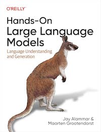

# Hands-On Large Language Models

[home](../)

* Title: Hands-On Large Language Models
* Subtitle: Language Understanding and Generation
* **Authors**: Jay Alammar and Maarten Grootendorst
* **Publisher**: O'Reilly
* **Date**: 2024
* *ISBN-13*: 978-1098150969

## Blurb

AI has acquired startling new language capabilities in just the past few years. Driven by rapid advances in deep learning, language AI systems are able to write and understand text better than ever before. This trend is enabling new features, products, and entire industries. Through this book's visually educational nature, readers will learn practical tools and concepts they need to use these capabilities today.

You'll understand how to use pretrained large language models for use cases like copywriting and summarization; create semantic search systems that go beyond keyword matching; and use existing libraries and pretrained models for text classification, search, and clusterings.

This book also helps you:

* Understand the architecture of Transformer language models that excel at text generation and representation
* Build advanced LLM pipelines to cluster text documents and explore the topics they cover
* Build semantic search engines that go beyond keyword search, using methods like dense retrieval and rerankers
* Explore how generative models can be used, from prompt engineering all the way to retrieval-augmented generation
* Gain a deeper understanding of how to train LLMs and optimize them for specific applications using generative model fine-tuning, contrastive fine-tuning, and in-context learning

## Contents

* Chapter 1: Introduction to Language Models
* Chapter 2: Tokens and Embeddings
* Chapter 3: Looking Inside Transformer LLMs
* Chapter 4: Text Classification
* Chapter 5: Text Clustering and Topic Modeling
* Chapter 6: Prompt Engineering
* Chapter 7: Advanced Text Generation Techniques and Tools
* Chapter 8: Semantic Search and Retrieval-Augmented Generation
* Chapter 9: Multimodal Large Language Models
* Chapter 10: Creating Text Embedding Models
* Chapter 11: Fine-tuning Representation Models for Classification
* Chapter 12: Fine-tuning Generation Models

## Links

* [Amazon](https://a.co/d/hXs5jDF)
* [GoodReads](https://www.goodreads.com/book/show/210408850-hands-on-large-language-models)
* [Publisher](https://www.oreilly.com/library/view/hands-on-large-language/9781098150952/)
* [GitHub](https://github.com/HandsOnLLM/Hands-On-Large-Language-Models)