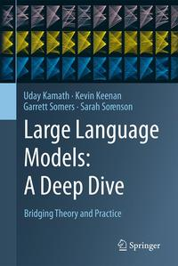

# Large Language Models

[home](../)

## Details

* **Title**: Large Language Models
* **Subtitle**: A Deep Dive: Bridging Theory and Practice
* **Authors**: Uday Kamath, Kevin Keenan, Garrett Somers, and Sarah Sorenson
* **Publication Date**: 2024
* **Publisher**: Springer
* **ISBN-13**: 978-3031656460
* **Pages**: 506

**Links**: [Amazon](https://a.co/d/6IMNpkX) |
[Goodreads](https://www.goodreads.com/book/show/214355031-large-language-models) |
[Publisher](https://link.springer.com/book/10.1007/978-3-031-65647-7) |
[GitHub Project](https://github.com/springer-llms-deep-dive/llms-deep-dive-tutorials)

## Blurb

Large Language Models (LLMs) have emerged as a cornerstone technology, transforming how we interact with information and redefining the boundaries of artificial intelligence. LLMs offer an unprecedented ability to understand, generate, and interact with human language in an intuitive and insightful manner, leading to transformative applications across domains like content creation, chatbots, search engines, and research tools. While fascinating, the complex workings of LLMs―their intricate architecture, underlying algorithms, and ethical considerations―require thorough exploration, creating a need for a comprehensive book on this subject.

This book provides an authoritative exploration of the design, training, evolution, and application of LLMs. It begins with an overview of pre-trained language models and Transformer architectures, laying the groundwork for understanding prompt-based learning techniques. Next, it dives into methods for fine-tuning LLMs, integrating reinforcement learning for value alignment, and the convergence of LLMs with computer vision, robotics, and speech processing. The book strongly emphasizes practical applications, detailing real-world use cases such as conversational chatbots, retrieval-augmented generation (RAG), and code generation. These examples are carefully chosen to illustrate the diverse and impactful ways LLMs are being applied in various industries and scenarios.

Readers will gain insights into operationalizing and deploying LLMs, from implementing modern tools and libraries to addressing challenges like bias and ethical implications. The book also introduces the cutting-edge realm of multimodal LLMs that can process audio, images, video, and robotic inputs. With hands-on tutorials for applying LLMs to natural language tasks, this thorough guide equips readers with both theoretical knowledge and practical skills for leveraging the full potential of large language models.

This comprehensive resource is appropriate for a wide audience: students, researchers and academics in AI or NLP, practicing data scientists, and anyone looking to grasp the essence and intricacies of LLMs.

Key Features:

* Over 100 techniques and state-of-the-art methods, including pre-training, prompt-based tuning, instruction tuning, parameter-efficient and compute-efficient fine-tuning, end-user prompt engineering, and building and optimizing Retrieval-Augmented Generation systems, along with strategies for aligning LLMs with human values using reinforcement learning
* Over 200 datasets compiled in one place, covering everything from pre- training to multimodal tuning, providing a robust foundation for diverse LLM applications
* Over 50 strategies to address key ethical issues such as hallucination, toxicity, bias, fairness, and privacy. Gain comprehensive methods for measuring, evaluating, and mitigating these challenges to ensure responsible LLM deployment
* Over 200 benchmarks covering LLM performance across various tasks, ethical considerations, multimodal applications, and more than 50 evaluation metrics for the LLM lifecycle
* Nine detailed tutorials that guide readers through pre-training, fine- tuning, alignment tuning, bias mitigation, multimodal training, and deploying large language models using tools and libraries compatible with Google Colab, ensuring practical application of theoretical concepts
* Over 100 practical tips for data scientists and practitioners, offering implementation details, tricks, and tools to successfully navigate the LLM life- cycle and accomplish tasks efficiently

## Contents

1. Large Language Models: An Introduction
2. Language Models Pre-training
3. Prompt-based Learning
4. LLM Adaptation and Utilization
5. Tuning for LLM Alignment
6. LLM Challenges and Solutions
7. Retrieval-Augmented Generation
8. LLMs in Production
9. Multimodal LLMs
10. LLMs: Evolution and New Frontiers
