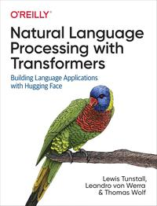

# Natural Language Processing with Transformers

[home](../)

## Details

* **Title**: Natural Language Processing with Transformers
* **Subtitle**: Building Language Applications with Hugging Face
* **Authors**: Lewis Tunstall, Leandro von Werra and Thomas Wolf
* **Publication Date**: 2022
* **Publisher**: O'Reilly
* **ISBN-13**: 978-9355420329
* **Pages**: 406

**Links**: [Amazon](https://a.co/d/5WIiVAC) |
[Goodreads](https://www.goodreads.com/book/show/60114857-natural-language-processing-with-transformers) |
[Publisher](https://www.oreilly.com/library/view/natural-language-processing/9781098136789/) |
[GitHub Project](https://github.com/nlp-with-transformers/notebooks)

## Blurb

Since their introduction in 2017, transformers have quickly become the dominant architecture for achieving state-of-the-art results on a variety of natural language processing tasks. If you're a data scientist or coder, this practical book shows you how to train and scale these large models using Hugging Face Transformers, a Python-based deep learning library.

Transformers have been used to write realistic news stories, improve Google Search queries, and even create chatbots that tell corny jokes. In this guide, authors Lewis Tunstall, Leandro von Werra, and Thomas Wolf, among the creators of Hugging Face Transformers, use a hands-on approach to teach you how transformers work and how to integrate them in your applications. You'll quickly learn a variety of tasks they can help you solve.

* Build, debug, and optimize transformer models for core NLP tasks, such as text classification, named entity recognition, and question answering
* Learn how transformers can be used for cross-lingual transfer learning
* Apply transformers in real-world scenarios where labeled data is scarce
* Make transformer models efficient for deployment using techniques such as distillation, pruning, and quantization
* Train transformers from scratch and learn how to scale to multiple GPUs and distributed environments

## Table of Contents

1. Introduction
2. Text Classification
3. Transformer Anatomy
4. Multilingual Named Entity Recognition
5. Text Generation
6. Summarization
7. Question Answering
8. Making Transformers Efficient in Production
9. Dealing with Few to No Labels
10. Training Transformers from Scratch
11. Future Directions
