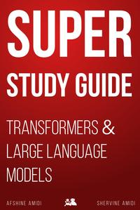

# Super Study Guide

[home](../)

## Details

* **Title**: Super Study Guide
* **Subtitle**: Transformers & Large Language Models
* **Authors**: Afshine Amidi and Shervine Amidi 
* **Publication Date**: 2024
* **Publisher**: Independently published
* **ISBN-13**: 979-8836693312
* **Pages**: 247
* **Amazon Rating**: 4.6 stars
* **Goodreads Rating**: 4.58 stars

**Links**: [Amazon](https://a.co/d/aE3pz72) |
[Goodreads](https://www.goodreads.com/book/show/217141763-super-study-guide) |
[Publisher](https://superstudy.guide/transformers-large-language-models/)

## Blurb

This book is a concise and illustrated guide for anyone who wants to understand the inner workings of large language models in the context of interviews, projects or to satisfy their own curiosity.

It is divided into 5 parts:

* Foundations: primer on neural networks and important deep learning concepts for training and evaluation
* Embeddings: tokenization algorithms, word-embeddings (word2vec) and sentence embeddings (RNN, LSTM, GRU)
* Transformers: motivation behind its self-attention mechanism, detailed overview on the encoder-decoder architecture and related variations such as BERT, GPT and T5, along with tips and tricks on how to speed up computations
* Large language models: main techniques to tune Transformer-based models, such as prompt engineering, (parameter efficient) finetuning and preference tuning
* Applications: most common problems including sentiment extraction, machine translation, retrieval-augmented generation and many more

## Contents

1. Foundations
2. Embeddings
3. Transformers
4. Large language models
5. Applications
