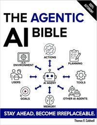

# The Agentic AI Bible

[home](../)

## Details

* **Title**: The Agentic AI Bible
* **Subtitle**: The Complete and Up-to-Date Guide to Design, Build, and Scale Goal-Driven, LLM-Powered Agents that Think, Execute and Evolve
* **Authors**: Thomas R. Caldwell
* **Publication Date**: 2025
* **Publisher**: Independently published
* **ISBN-13**: 979-8296391360
* **Pages**: 459
* **Amazon Rating**: 4.7 stars
* **Goodreads Rating**: 3.67 stars

**Links**: [Amazon](https://amzn.to/3L6prAo) |
[Goodreads](https://www.goodreads.com/book/show/239144737-the-agentic-ai-bible)

## Blurb

The Complete Engineering Blueprint for Designing and Scaling LLM-Powered Autonomous Agents

Agent-based AI is no longer a futuristic dream—it’s the next phase of intelligent software.

Yet for most teams, the path to building real-world agentic systems is filled with chaos: bloated prototypes that can’t scale, brittle tools duct-taped together, unclear architectures, and zero visibility into performance or safety.

Most technical leaders are left asking the same questions:

How do we move beyond demos to dependable systems?

How do we orchestrate perception, reasoning, and action in complex environments?

How do we design agents that can think, execute, and evolve—while remaining safe, observable, and maintainable?

The Agentic AI Bible delivers clear, practical answers.

Designed for engineers, system architects, and AI product leads, this comprehensive guide breaks down the entire lifecycle of agentic systems—from foundational design principles to deployment and real-world application—backed by current best practices, production-ready tools, and future-facing insights.

Here is a mere fraction of what you will learn:

* The core principles and modular architecture patterns that power modern agentic systems so you can design agents with reasoning, memory, and planning from the ground up
* How to implement LLM-powered agents with perception, action, and environment loops to create systems that can interact with the world, not just respond to prompts
* Advanced behavioral patterns such as recursive reasoning, self-reflection, and goal reprioritization to ensure agents can adapt in real time
* 3 secret design strategies for safety, reliability, and testability that prevent catastrophic errors and keep your agents under control
* How to connect your agents with external tools, APIs, and long-term workflows so they can handle multi-step tasks with real business impact
* 6 benchmarking frameworks and evaluation metrics that help you measure intelligence, robustness, and operational readiness in complex settings
* Real-world applications across industries—from finance to robotics—and how to tailor agent capabilities to domain-specific needs
* Deployment architectures, scaling strategies, and monitoring systems that ensure your agents don’t just work, but continue improving over time

And much, much more!

While other books skim the surface or focus narrowly on theory, The Agentic AI Bible delivers the full lifecycle—from architecture to deployment to governance—designed for professionals who need working systems, not academic demos.

Whether you're building a personal AI assistant, a robotic process orchestrator, or a full-blown autonomous multi-agent system, this book offers the technical blueprint you need to deliver robust, goal-driven, LLM-powered agents that perform at scale.

If you're ready to move past academic toy projects and start delivering agentic AI that works in production, this is the guide you've been waiting for.

## Contents

1. Introduction to Agentic AI
2. Core Principles of Generative and Agentic AI
3. Architectures and Design Patterns
4. Building Blocks: Perception, Action, and Environment
5. Practical Guide to Implementing Agentic AI
6. Advanced Agentic Behaviors
7. Enabling External Tool Use and Complex Task Planning
8. Design Patterns for Reliability and Safety
9. Agent Evaluation & Benchmarking
10. Multi-Agent Systems
11. Security & Robustness
12. Agentic AI in Healthcare
13. Agentic AI in Finance
14. Agentic AI in Robotics
15. Agentic AI in Business and Operations
16. Other Domains
17. Legal Landscape of Agentic AI
18. Risk Management Playbook
19. Human-Agent Collaboration
20. Adoption Challenges
21. Landscape of Agentic AI Tools
22. Open-Source Projects and Communities
23. Deployment Architectures and Strategies
24. Integration with Enterprise Systems
25. Monitoring, Maintenance, and Operations
26. Scaling Agentic AI Systems
27. Case Studies: From Prototype to Production
28. Transparency, Accountability, and Reliability
29. Ethical and Societal Considerations
30. Future Directions
