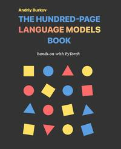

# The Hundred-Page Language Models Book

[home](../)

## Details

* **Title**: The Hundred-Page Language Models Book
* **Subtitle**: Hands-on with PyTorch
* **Authors**: Andriy Burkov
* **Publication Date**: 2025
* **Publisher**: True Positive Inc.
* **ISBN-13**: 978-1778042720
* **Pages**: 156
* **Amazon Rating**: 4.8 stars
* **Goodreads Rating**: 4.5 stars

**Links**: [Amazon](https://amzn.to/4qqmtqt) |
[Goodreads](https://www.goodreads.com/book/show/223643924-the-hundred-page-language-models-book) |
[Publisher](https://www.thelmbook.com) |
[GitHub Project](https://github.com/aburkov/theLMbook)

## Blurb

Master language models through mathematics, illustrations, and code―and build your own from scratch!

The Hundred-Page Language Models Book by Andriy Burkov, the follow-up to his bestselling The Hundred-Page Machine Learning Book (now in 12 languages), offers a concise yet thorough journey from language modeling fundamentals to the cutting edge of modern Large Language Models (LLMs). Within Andriy's famous "hundred-page" format, readers will master both theoretical concepts and practical implementations, making it an invaluable resource for developers, data scientists, and machine learning engineers.

The Hundred-Page Language Models Book allows you to:

- Master the mathematical foundations of modern machine learning and neural networks
- Build and train three architectures of language models in Python
- Understand and code a Transformer language model from scratch in PyTorch
- Work with LLMs, including instruction finetuning and prompt engineering

Written in a hands-on style with working Python code examples, this book progressively builds your understanding from basic machine learning concepts to advanced language model architectures. All code examples run on Google Colab, making it accessible to anyone with a modern laptop.

About the technology

Language models have evolved from simple n-gram statistics to become one of the most transformative technologies in AI, rivaling only personal computers in their impact. This book spans the complete evolution—from count-based methods to modern Transformer architectures—delivering a thorough understanding of both how these models work and how to implement them.

About the book

The Hundred-Page Language Models Book takes a unique approach by introducing language modeling concepts gradually, starting with foundational methods before advancing to modern architectures. Each chapter builds upon the previous one, making complex concepts accessible through clear explanations, diagrams, and practical implementations.

What's inside

- Essential machine learning and neural network fundamentals
- Text representation techniques and basic language modeling
- Implementation of RNNs and Transformer architectures with PyTorch
- Practical guidance on finetuning language models and prompt engineering
- Important considerations on hallucinations and ways to evaluate models
- Additional resources for advanced topics through the book's wiki

## Contents

1. Machine Learning Basics
2. Language Modeling Basics
3. Recurrent Neural Network
4. Transformer
5. Large Language Model
6. Further Reading
